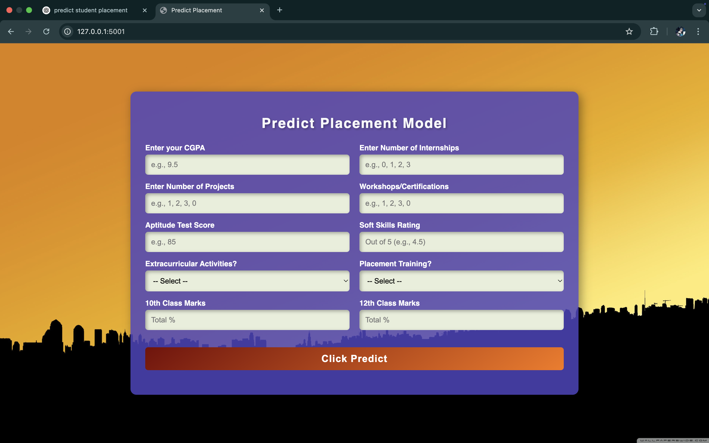
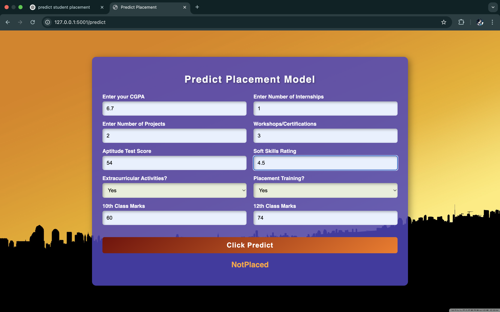

# 🎓 Final Placement Prediction System

This project is a machine learning-based web application designed to predict whether a student is likely to be placed based on their academic and extracurricular profile.

## 🔍 Features

- Predicts placement using trained ML model
- Flask-powered web interface
- Inputs include CGPA, internships, projects, certifications, aptitude score, soft skills, and more
- Responsive UI with clean layout

## 🚀 Technologies Used

- Python
- Scikit-learn
- Flask
- HTML/CSS
- Git/GitHub

## 📊 Model Input Features

- CGPA  
- Number of Internships  
- Number of Projects  
- Certifications / Workshops  
- Aptitude Test Score  
- Soft Skills Rating  
- Extracurricular Activities  
- Placement Training Attended  
- 10th Class Marks  
- 12th Class Marks  

## 🖼️ Screenshots

> Home Page:



> Prediction Page:


> Output Page:



## 🖥️ Running the Project Locally

1. Clone the repo:
    ```bash
    git clone https://github.com/dasmrpmunna/Placement-Prediction-System.git
    cd Placement-Prediction-System
    ```

2. Create a virtual environment and activate it:
    ```bash
    python -m venv env
    source env/bin/activate  # macOS/Linux
    env\Scripts\activate     # Windows
    ```

3. Install dependencies:
    ```bash
    pip install -r requirements.txt
    ```

4. Run the Flask app:
    ```bash
    python app.py
    ```

5. Open your browser and go to `http://127.0.0.1:5000`

## 📁 Project Structure

(You can add your folder structure here if you want.)

## 📄 License

This project is licensed under the [MIT License](LICENSE).  
Feel free to use, modify, and distribute — just give proper credit.
